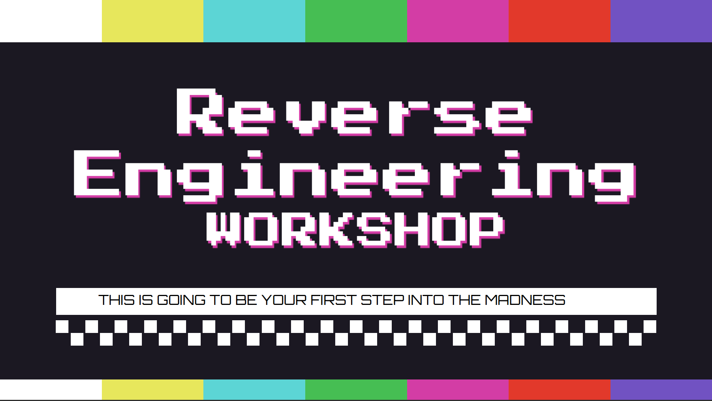
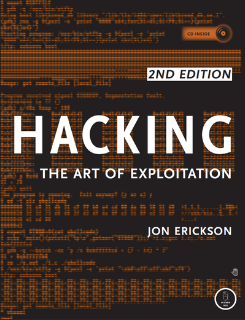
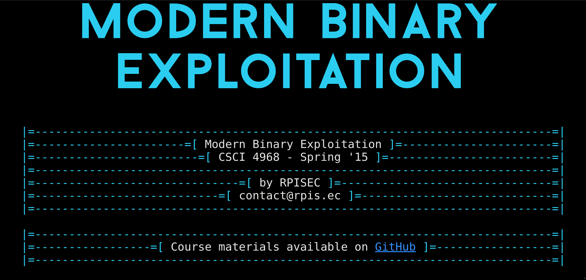

># Reverse Engineering Workshop

This workshop was an introduction to the vast world of reverse engineering, where we have discussed the usefullness of this skill, and some of the domaines where we use it essentialy in binary exploitaion and malware analysis.

>## Presentation 
You may find the presentation in this [link](https://drive.google.com/file/d/1YRF_8nWtwT4Lcym2GbGvnVcTrEPEx7M4/view?usp=sharing).

>## Nightmare 
***Description***: Nightmare is an intro to binary exploitation / reverse engineering course based around ctf challenges. It's called that because it's a lot of people's nightmare to get hit by weaponized 0 days, which these skills directly translate into doing that type of work. [Nightmare](https://guyinatuxedo.github.io/)

>## Hacking- The Art of Exploitation (2nd ed. 2008) - Erickson
This book is a "zero to hero" guide for reverse engineering and binary expoloitaion as it goes throught all the basic stuff that you from programming and C,assembly to using tools such as gdb to sockets and how to write shellcodes. Some things needs some updating but overrall it's a exellent start for someone who have just a basic understading of how a machine works.
[link to download to book](https://drive.google.com/file/d/1WgN5smh1dOJHtN_RJl_Xo4-G85LIZaBG/view?usp=sharing)

>## Modern Binary Exploitation course 
This course was made by [RIPSEC CLUB](https://rpis.ec/) from the [Rensselaer Polytechnic Institute](https://rpi.edu/), it gives more of a methodoligical way of the introducing the topic of Reverse enginneering where each Lecture is followed by practical labs with an increasing level of difficulty and you move forward. I highly recommend as i have used their ressources for my personnel learning.

[Course Link](http://security.cs.rpi.edu/courses/binexp-spring2015/)

>## Conclusion
Reverse engineering is not a skill that can't be gained overnight, it needs dedication and hard work, so don't get demotivated if you get stuck somewhere because we all been there many many many times, cause getting stuck means that you still have room for improvement and growth, so keep trying and failling cause through failure you learn and may even stumbel upon something new that no-one have seen before.
